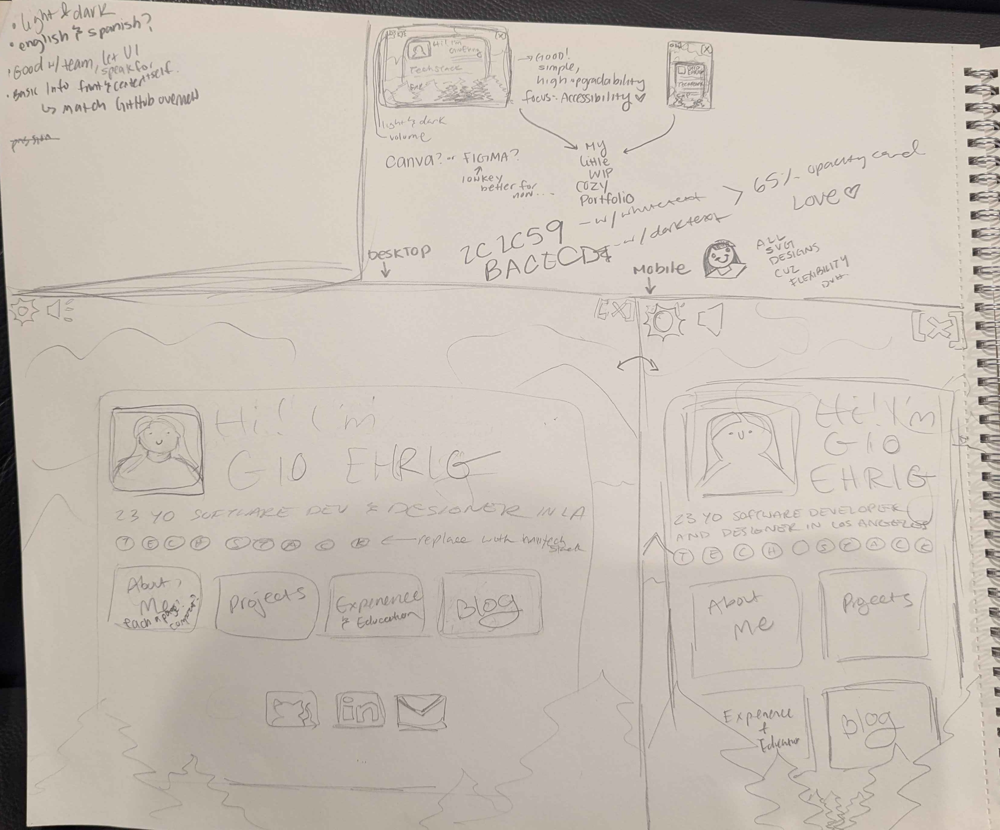
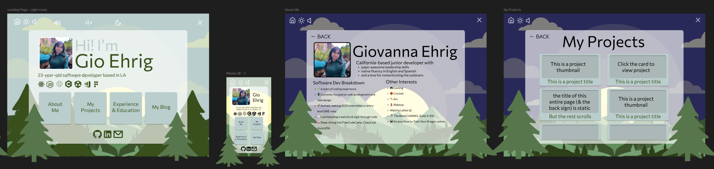

## Table of Contents
- [Background](#background)
- [Mindset & Design Process](#mindset-design-process)
- [Build Process](#process)
- [Final Product & Thoughts](#final-product-thoughts)
- [Lessons Learned](#lessons-learned)


<!-- ## Background -->
<h2 id="background">Background</h2>

Prior to this project, I had made a portfolio using **Next.js** and **Markdown**. While I was proud of that portfolio at the time, it was made before I had too much experience with web development and web design and I just wanted to make something as quickly as possible to have *something* under my belt. The process of making it was very nice, especially for a semi-beginner like me, but the product was just not something I was proud of. Design-wise, I wanted so much more and I felt like starting from scratch was easier than reworking the one I already had. 

So I went on a mission... scouring the internet to find inspiration and ways to improve my portfolio.

<h2 id="mindset-design-process">Mindset & Design Process</h2>

### Back to School 

During my job search and experience going from career fair to career fair, it really started to sink in that my lack of confidence stemmed from my lack of current skill set. I needed to study and build a more niche brand if I wanted to land a job in tech. Projects are great, but in the age of AI, it became way too easy for things to go over my head while making them. I decided to go back to my roots and learn the way I knew best, in a classroom, in the most accessible way possible. Hence, I started my journey with FreeCodeCamp! 

I started learning on FreeCodeCamp's Full Stack coursework, lecture after lecture, mini-project after mini-project. It was really good for my immediate satisfaction because I was racking up points like nobody's business and learning to code very very quickly. It also helped that alongside freeCodeCamp I was creating and using AI to assist projects that may or may not see the light of day. Little by little I was seeing myself understand more and more of how things work. 


### Research

When I wasn't coding, I was all over the software developer side of youtube, looking for advice on how to progress, watching other people's stories as developers and employers, and most importantly, portfolio and resume reviews. I noticed that different reviewers have different opinions about what a portfolio should look like and feel like, but there were a few common themes that really stuck with me.

1. **Your portfolio is a reflection of you** and the type of work you provide.
    - People use your porfolio to see the type of work that you do (as well as who you are) to determine whether or not they want to work with you.

2. **Intention matters**: What you say and don't say both impact your impression.
    - A jack of all traits is a master of none
    - Listing HTML and CSS as a frontend developer can make you look inexperienced
    - Repetition should be very intentional

3. **Ease** for the user will win points every time.
    - People should know within 5-10 seconds what they are getting themselves into
    - The website should be fast, responsive, and intuitive

By this point in time, I had curated a good collection of different portfolios I really like and that most closely resemble the energy I want to give. 

### The Aesthetic

I know about myself that I love **forest** aesthetics as much as I love a **modern** tech vibe. I wanted to find a way to combine the two in the **cosiest** way possible. The more I explored these concepts, the further I strayed from the simplistic, cute, rounded vibe that I usually like to implement with websites, so I took a few steps back. 

> How can I make a cute modern forest website and still have it reflect the way I like to build? 

I decided to go with a modern webpage format with forest themes and I liked it, but I was slightly bored. In most portfolios that I liked, I noticed they were very interactive. At this point, I started to full-on copy portfolio designs, changing what I liked until I eventually stumbled onto what I have now.

  
*My hand-drawn planning stage, including my thoughts and hex values as I saw fit.*


**Sparks flew!** I loved the design and the potential for expansion. It is so simple and sleek and I was able to add sound and easter eggs and make it very video game-like! Time to throw it into Figma. 

### From Sketch to Figma

This part was very easy actually. I had practice with Figma from the Hackathon I just finished. It was really nice, however, for being able to organize and find all of my SVGs BEFORE going in and implementing, as well as being able to work out some of the spacing that paper wasn't perfect with. 

  
*Dark and light mode concepts, mobile view, and additional pages from my forest portfolio.*


Once I had the Figma design it was time for me to decide my tech stack. I knew I wanted it to be easily expanded with projects and blogs, but otherwise there was no real need for a backend. I did some research on the best tech stacks for static websites and found my way to Gatsby. I had never heard of Gatsby but online it was pretty convincing with the promise of "speed, simplicity, and good plug-ins". I liked the idea of using a static-page-efficient React-based framework and expanding my tech stack.

I looked up how to get started with Gatsby with the idea that "I could probably figure it out" and got right into it. 

<h2 id="process"> Build Process</h2>

Like many new-age developers, I looked up ```"how to set up a Gatsby app"``` and started on my new journey with Gatsby. 

I threw my Figma designs into ChatGPT for starter code, and then turned those drafts into something I am genuinely proud of. I added plugins, customized components, and with a bunch of hustle and bustle, got my project to where it needed to be!

In all honesty, **working with Gatsby was not my favorite experience**. The build time, even for the development build was fairly long. I don't have the greatest internet and sometimes it would fail entirely because my Wi-Fi would crash mid-build. However, it did give me a very solid-looking product and I have had no issues with the smoothness of how it came out. 

**Developer Experience Rating:** 6/10. 

I am sure if I had more time with it I could make really good use of the plugins, but I still feel like there are better alternatives for me. 

<h2 id="final-product-thoughts">Final Product & Thoughts</h2>

In the end, I now have a forest-themed, gamified web developer portfolio that's playful yet professional, with plenty of room for expansion.

I plan to:

- Strengthen my existing projects

- Add more blog posts

- Keep improving the interactivity and “hidden gem” features

Thank you for reading if you made it this far! I appreciate your interest in my work. <3


---
<h2 id="lessons-learned">Lessons Learned</h2>
- Blend personality with professionalism — The forest theme reflects me, but the structure keeps it recruiter-friendly.

- Prototype before coding — Designing in Figma saved time and helped me organize assets.

- Framework choice matters — Gatsby looks great but had slow build times for me.

- Interactivity elevates portfolios — Little touches like sound, animations, and easter eggs make it memorable.

- Continuous improvement is key — A portfolio isn’t “done”; it grows as you grow.