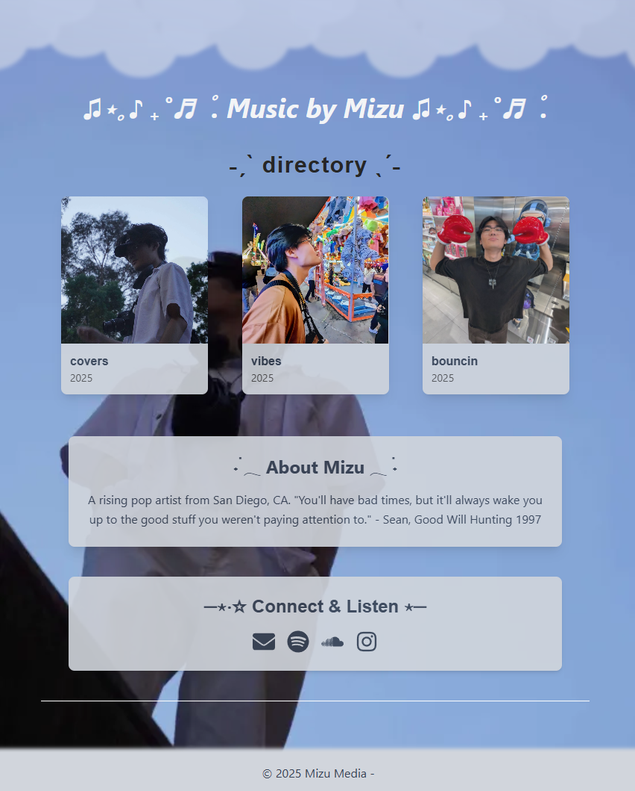
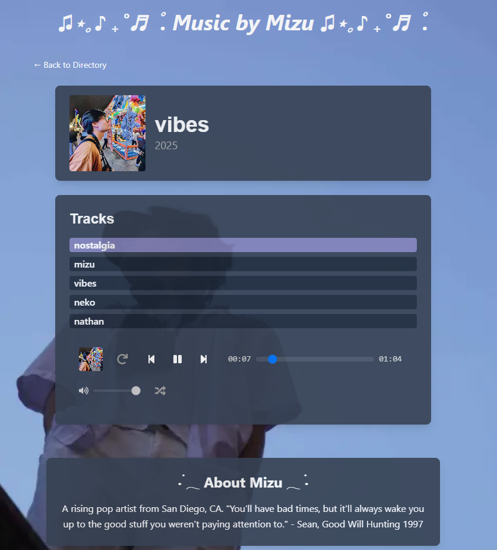

## Summary

Erik Shimizu, aka MIZU, is an 21-year-old music producer in San Diego, California. While currently pursuing a career as an embedded systems engineer, he has yet to let go of his dream of pursuing music. Inspired by Madeon and Fiji Blue, he hopes to bring something new to the air of EDM. 

## Fun Facts
 Alongside music, MIZU loves watching hockey, playing sports, and hanging out with his friends!

 He is a big fan of Good Will Hunting and Tron: Legacy.

## What is this?

Music by MIZU is a music portfolio, made by Giovanna Ehrig. While currently under development, it is a fully functioning website with links to MIZU's work and playing demos for fans! As a developer, I am currently working on making a content management system so that MIZU can update this page with new songs, update links, add albums, and overall update the database without needing to know how the code works. 

Check out the <a href="https://music-by-mizu.vercel.app/" target="_blank">live demo</a> or the <a href="https://github.com/uhohgio/music-by-mizu" target="_blank">GitHub repo</a>!

#### Technologies Used

- React
- Node.js

#### Features

- Responsive Design
- Plays Audio

## Photo Gallery

*A screenshot of the project's main interface in dark mode.*

*A screenshot of the project's main interface in light mode.*

*A screenshot of the music player associated with the vibes album.*