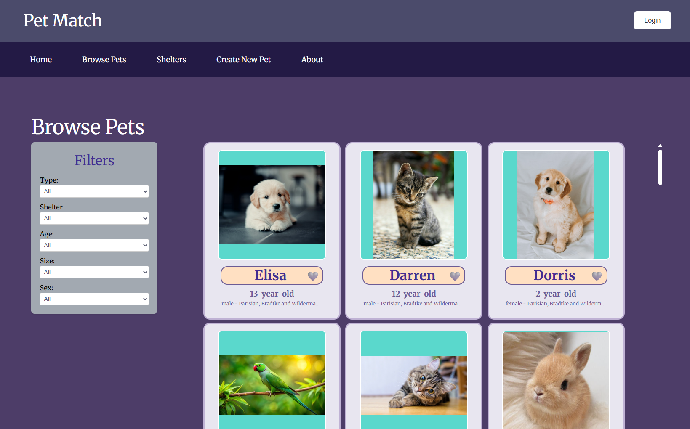
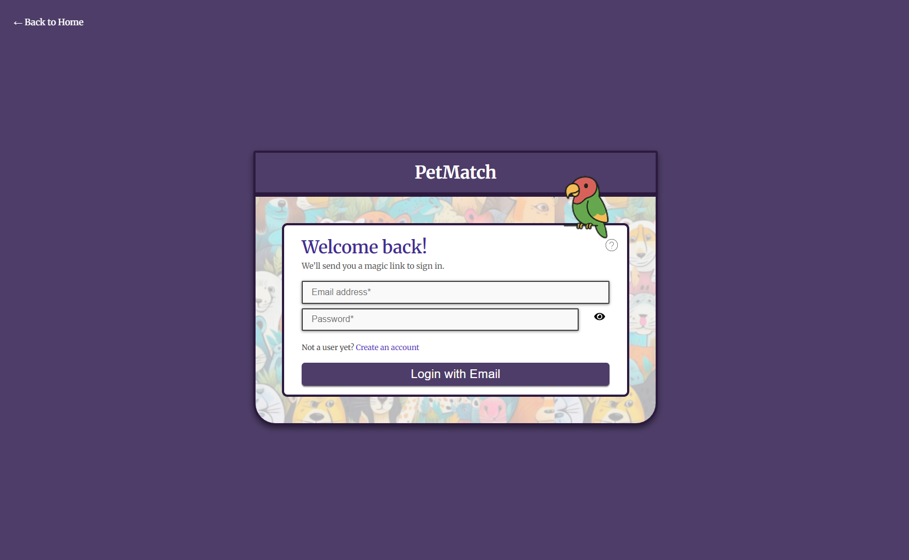
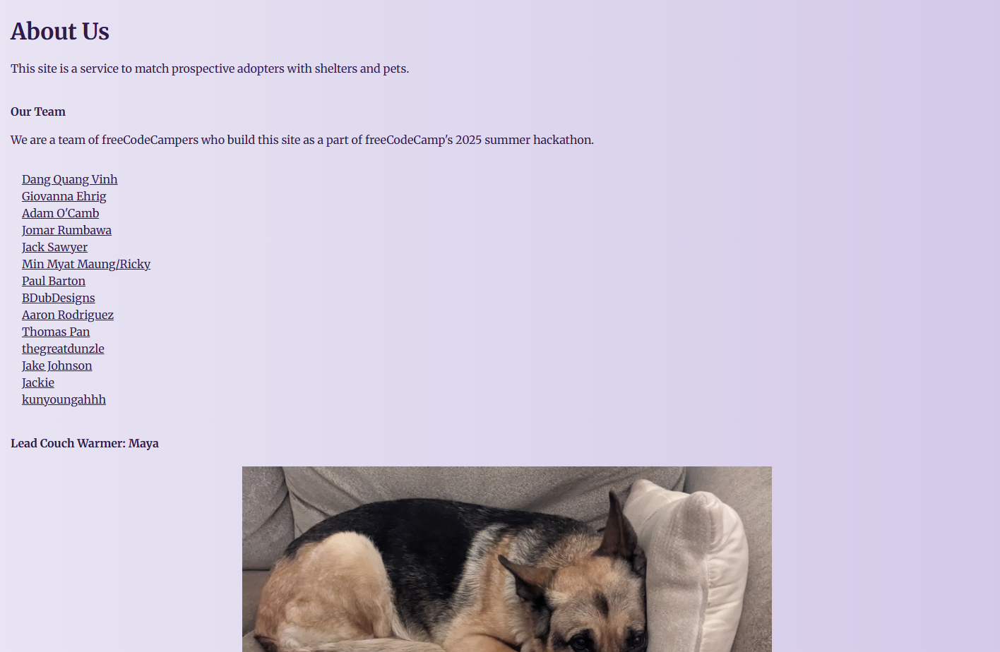
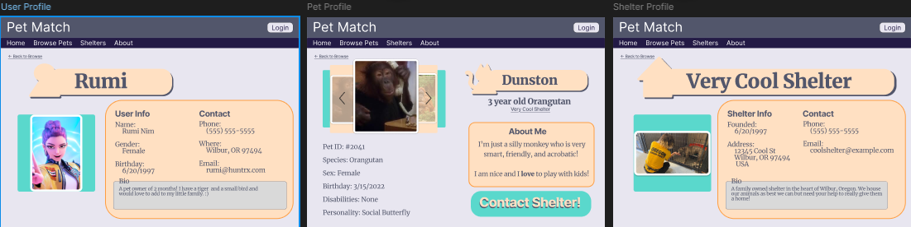

## Summary

Over the course of one month, team *yellow-packet* built a full-stack pet adoption platform from scratch as part of the FreeCodeCamp Summer Hackathon. From initial planning to deployment-ready code, we navigated technical and collaborative challenges to deliver a product I’m genuinely proud of.

## My Role

As the Frontend Lead on a cross-functional team, I was responsible for designing the architecture of our client-side application, establishing scalable component hierarchies, and ensuring a cohesive and responsive user interface aligned with our vision of an intuitive pet adoption platform.

I guided the team in adopting best practices for state management, component reuse, and accessibility, while also coordinating the division of frontend tasks using tools like GitHub Projects and Figma. My goal wasn’t just to build interfaces, but to create a foundation that could scale gracefully as features expanded.

Beyond my official role, I contributed significantly to the backend—collaborating on RESTful API routes and MongoDB schemas—when the team pace required extra hands. I leaned into the challenge of context-switching between frontend and backend, strengthening my understanding of full-stack application lifecycles and asynchronous data flows.

This project demanded adaptability, technical leadership, and a strong product mindset—all of which I honed in the process.

## Challenges & Takeaways

Transitioning from independent development to a collaborative, deadline-driven team environment was one of the most formative parts of this experience. While I initially struggled with pacing myself against team bottlenecks and coordinating across roles, these moments pushed me to improve my communication, empathy, and overall developer maturity.

I learned to reframe waiting on others not as a blocker, but as a chance to support, mentor, or re-prioritize—skills essential to working in agile, team-based settings. Through pair programming, code reviews, and async stand-ups, I became more thoughtful about how my work integrates with others and how to give and receive feedback effectively.

More than anything, this hackathon reinforced my love for building real-world applications, deepened my appreciation for strong developer experience (DX), and gave me confidence that I can thrive in a fast-paced, collaborative software environment. It was more than a project—it was a turning point in how I approach building and shipping software with others.

## Team & Workflow

Our team, codenamed yellow-packet, consisted of two project managers and frontend and backend developers with a mix of experience levels. Early on, we established a lightweight but structured workflow inspired by Agile methodologies. We held weekly planning meetings, midweek check-ins, and async updates through Discord and GitHub Issues to maintain momentum.

I helped organize and document our tasks using GitHub Projects, breaking down features into manageable units that could be tackled in parallel. Design drafts and user flow diagrams were shared via Figma and Miro, giving everyone a shared visual reference. To minimize merge conflicts and speed up integration, we used feature branches, regular PR reviews, and linting pipelines. It was also my first introduction to rebasing, which was used diligently.

Communication was key. We made space for pair programming, mentorship, and open dialogue about blockers or design decisions. While not everything went perfectly, we consistently improved our collaboration and velocity over time—just like a real-world product team.

## Lessons Learned
This hackathon pushed me to grow both technically and interpersonally. Here are a few key takeaways:

- **Ownership = Momentum:** I learned that stepping up when there’s a gap (whether it’s frontend or backend) can make the difference between stagnation and progress. Initiative matters.

- **Communication over Perfection:** Sometimes it's better to ship an imperfect PR and ask for feedback than to go quiet trying to make it perfect. Learning to communicate transparently helped me unblock teammates and get better input.

- **Good UX Starts with Empathy:** Designing for pet adopters and shelter admins made me think critically about accessibility, trust, and simplicity. User empathy drove many of our design choices.

- **Version Control Discipline:** Working in a team made me deeply appreciate consistent commit messages, atomic PRs, and git hygiene. These practices saved us more than once.

- **Full-Stack Awareness Pays Off:** Even though I focused on the frontend, understanding the backend architecture helped me build smarter, more resilient client-side features—and made debugging much smoother.

## Features

- Browse adoptable pet profiles
- View and explore shelter pages
- Log in and favorite pets
- Adoption inquiry system

## Technologies

- MongoDB
- Express
- React
- Node.js

---

🚧 Live demo coming soon  
🔗 [GitHub Repo](https://github.com/freeCodeCamp-2025-Summer-Hackathon/yellow-packet)

## Photo Gallery

*A screenshot of the browse page where you can filter and view pets.*

*A screenshot of the login page if you have a shelter or adopter's account.*

*A screenshot of the about us page.*

*A screenshot of the profile designs on figma before they were implemented.*
