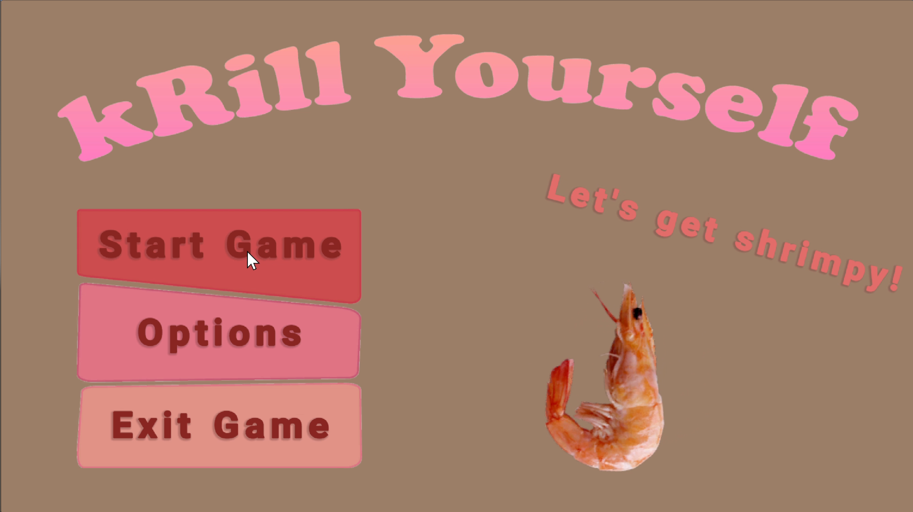
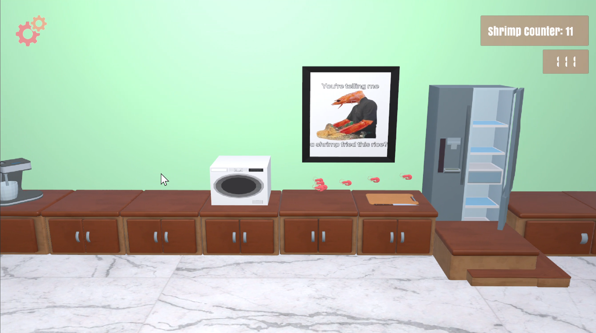
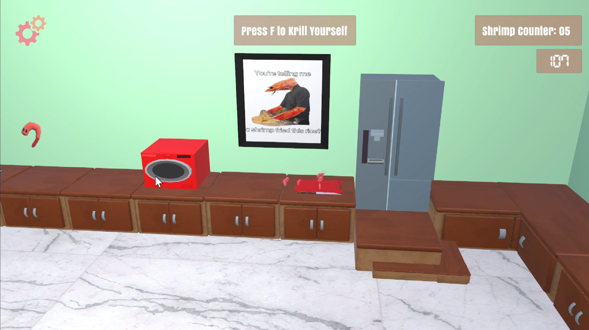
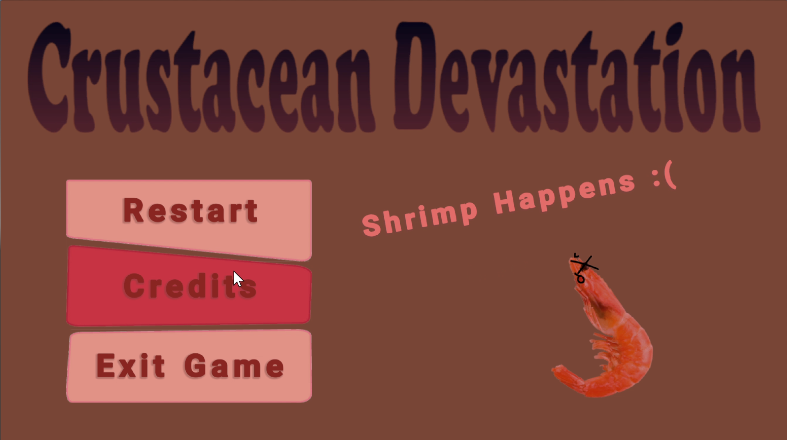
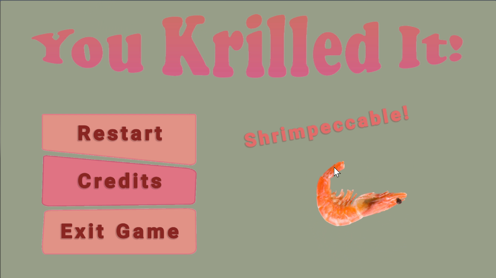

## Summary

Krill Yourself is a casual 3D strategy game made in Unity featuring a troupe of shrimp in a race against the clock to cook themselves. With this pun-filled project in the makes, a group of 6 college students, known as the Ebi Troupe, have fun building a simple platformer with plenty hidden shrimp secrets.

## My Role

On this project I took on the role of UI/UX Designer. I was responsible for all menu screens and any constant visual feedback. This includes but is not limited to the start screen, pause screen, options, credits, and timer/shrimp count feedback during gameplay. Due to the complexity of these features and the division of tasks we decided upon, I worked closely with the team members associated with audio and game managers. We worked together to make decisions that best benefited the user experience and ensure an intuitive and responsive screen. 

## Challenges & Takeaways

Designing for chaos requires clarity. As the UX designer and one of the originators of the game concept, my primary challenge was building a visual and interactive language that could ground the player amidst intentionally frantic gameplay. I designed UI elements that communicated essential game states (shrimp count, appliance cooldowns, round timers, and warnings) while maintaining the comedic, fast-paced tone of the game.

Working with a team of six, I also coordinated with developers and gameplay designers to make sure UI interactions felt meaningful—especially where player actions triggered animations, sounds, or game state changes. Every menu and in-game element had to be both charming and functional.

## Team & Workflow

This project was developed by The Ebi Troupe, a group of six college students, where I served as the UI/UX Designer and one of the core visionaries behind the concept.

#### My workflow included:

- **Ideation & Game Design:** Co-created the game concept and gameplay loop (shrimp swarm, appliance mechanics, Crustacean Devastation).

- **UI/UX Execution:** Designed and implemented the full UI suite — start menu, pause menu, settings, credits, and in-game HUD elements such as shrimp counter and timer.

- **Visual Systems Thinking:** Established visual hierarchy and feedback loops for critical gameplay information (appliance cooldowns, swarm feedback, win/loss states).

- **Collaboration:** Worked closely with the gameplay and audio teams to sync UI cues with game logic and sound events.

We used Unity (URP) for development and GitHub for version control and project collaboration.

## Lessons Learned

- **UI is Gameplay:** For chaotic, fast-paced games like Krill Yourself, UI isn’t just an overlay — it’s the only tether players have to understand the madness. This project reinforced how integral feedback, clarity, and visual rhythm are to the gameplay experience.

- **Leadership Can Be Quietly Loud:** I played a pivotal role in moving the project forward during slower periods and helped anchor the team with strong documentation, consistent implementation, and creative problem-solving.

- **Designing for Delight:** Integrating shrimp puns, dynamic warnings, and playful interface elements reminded me how humor and style can enhance usability—especially in casual games.

#### Features

- 🔥 Real-time cooking mechanics using various appliances with unique capacities and cooldowns

- 🦐 Swarm-based shrimp control — the player commands a chaotic troupe with a single input

- ⏱️ Dynamic UI feedback — responsive HUD for time, score, and shrimp count

- ⚠️ Crustacean Devastation meter — a warning system to signal shrimp overload

- 🎮 Stylized menu system with animated transitions and thematic design

- 🔊 Audio-visual feedback integration for key gameplay events (e.g., shrimp cooking, new arrivals)

#### Technologies

- Unity (URP)

- C# Scripting

- Adobe Illustrator (UI asset creation)

- GitHub (team collaboration and version control)

---

🚧 Live demo coming soon  

🔗 <a href="https://github.com/irmtou/ebishrimp" target="_blank">GitHub Repo (check the gio's-updates branch for most recent updates)</a>

📚 <a href="https://docs.google.com/document/d/1O2gDnHEanvHC_tfeFS59FHc8d7Si-940SkPgaRCQXas/edit?usp=sharing" target="_blank">The most current documentation</a>

## Photo Gallery

*The main menu: what the user sees upon load up.*

*When new shrimp are added to the troupe, shrimp spawn from the fridge and visually join the rest.*

*When an appliance is busy, it is red so a player knows not to waste their time there. There is also a text indicator above when an appliance is free to use.*

*When a player loses, they are redirected to this screen.*

*When a player wins, they are redirected to this screen.*
